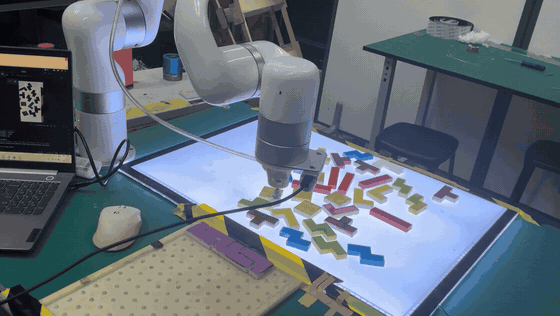

# Tetris Robot：xArm6 + ROS2 视觉抓取与放置系统

基于 ROS2 Humble、xArm6 和 Intel RealSense 的机器人流水线，将彩色俄罗斯方块的视觉检测、放置规划与机械臂执行串联起来。

   

## 实机演示



GIF 截取自团队实机演示视频的 12–23 秒，展示 xArm6 从散乱方块区抓取、搬运并放入托盘的过程。它能够证明实机链路实际运行过，但不单独代表完整任务成功率。

## 竞赛背景与证据

团队技术报告记载，本项目参加第九届中国高校智能机器人创意大赛“基于 ROS 技术应用的机器人挑战赛（六轴机器人竞赛组）”。

报告包含系统架构、视觉算法、双矩阵标定、DFS 放置规划、ROS2 迁移和实验结果。为避免把报告自述当成独立复测结果，已将可核实内容、视频证据、报告指标及与当前源码的差异整理到 [技术报告摘要](docs/technical_report_summary.md)。

## 系统流程

```text
RealSense
    │  /camera/camera/color/image_raw
    ▼
detection_node ── /detected_targets ──► sorter_node
                                               │ DFS 放置顺序
                                               ▼
xArm ROS2 services ◄── move_service ◄── /Move_Once
```

| 模块 | 作用 | 主要实现 |
| --- | --- | --- |
| `color_detector` | 识别方块颜色、位置和偏转角 | K-means、二值化、轮廓分析、编码区域解码 |
| `block_sorter/sorter_node` | 生成放置顺序并调度动作 | 14×10 网格 DFS、7 类方块、19 种旋转形态 |
| `block_sorter/move_service` | 执行抓取与放置 | xArm 笛卡尔运动、CGPIO 真空吸盘控制 |
| 标定脚本 | 建立相机/网格到机器人坐标的映射 | 两组二维仿射变换 |

## 项目实现范围

本仓库中与任务直接相关的代码主要集中在：

- `src/color_detector/`：视觉检测节点、自定义消息和图像处理脚本。
- `src/block_sorter/`：DFS 策略、调度节点、抓取服务和自定义服务。
- `scripts/calibration/`：取料区与放料区标定工具。
- `scripts/start_pipeline.sh`、`scripts/start_color.sh`：驱动、相机和项目节点的启动编排。
- `config/workcell.example.yaml`：仿射矩阵、拍照位姿和取放参数。
- `docs/`：系统架构和运行说明。

仓库当前只有“一次性导入”和 README 翻译两条 Git 提交，无法仅凭历史复原上述代码的个人/团队贡献比例，也不能验证现有文档中的 ROS1 迁移过程。用于作品集前，应补充旧工程、迁移 diff 或作者确认记录。

## 环境与硬件

- Ubuntu 22.04
- ROS2 Humble
- UFACTORY xArm6 与控制盒
- Intel RealSense D415；启动脚本当前固定使用 `realsense2_camera`
- 通过 CGPIO port 1 控制的真空吸盘
- OpenCV、PCL、RealSense ROS2 wrapper

其他相机需要替换驱动并调整图像 topic，当前仓库没有验证“任意 USB 相机”兼容性。

## 快速开始

```bash
git clone https://github.com/jerryalinalin/TetrisRobot-xArm-ROS2.git
cd TetrisRobot-xArm-ROS2

rosdep install --from-paths src --ignore-src -r -y
colcon build --symlink-install --cmake-args -DCMAKE_BUILD_TYPE=Release
source install/setup.bash

./scripts/start_pipeline.sh <机械臂IP地址>
```

请显式传入机械臂 IP，不要直接依赖脚本中的默认局域网地址。运行前还需在 `src/xarm_api/config/xarm_user_params.yaml` 中启用吸盘所需服务：

```yaml
ufactory_driver:
  ros__parameters:
    services:
      set_cgpio_digital: true
      set_cgpio_analog: true
```

### 调试与标定

```bash
# 仅启动颜色检测相关流程
./scripts/start_color.sh <机械臂IP地址>

# 首次部署时建立坐标映射
python3 scripts/calibration/calibrate_pick.py
python3 scripts/calibration/calibrate_place.py
```

全流程默认读取 `config/workcell.example.yaml`。也可以将第二个参数指向独立的本地工位配置：

```bash
./scripts/start_pipeline.sh <机械臂IP地址> /path/to/workcell.yaml
```

## ROS2 接口

| 名称 | 类型 | 用途 |
| --- | --- | --- |
| `/detected_targets` | `color_detector/msg/DetectedTargetArray` | 发布检测到的方块数组 |
| `DetectedTarget` | `color_detector/msg/DetectedTarget` | 传递颜色、位置、角度和状态信息 |
| `/Move_Once` | `block_sorter/srv/MoveOnce` | 提交一次取料坐标、放料坐标和末端角度 |

`sorter_node` 使用 `MultiThreadedExecutor`、互斥 callback group 和 `future.wait_for()`，避免目标回调重入并等待机械臂服务返回。

## 项目结构

```text
TetrisRobot-xArm-ROS2/
├── config/
│   └── workcell.example.yaml
├── docs/
├── scripts/
│   ├── start_color.sh
│   ├── start_pipeline.sh
│   └── calibration/
│       ├── calibrate_pick.py
│       └── calibrate_place.py
└── src/
    ├── block_sorter/       # 项目：策略与执行
    ├── color_detector/     # 项目：视觉检测
    ├── xarm_api/           # 第三方：xArm ROS2 驱动
    ├── xarm_description/   # 第三方：模型与网格
    ├── xarm_msgs/          # 第三方：消息与服务
    ├── xarm_sdk/           # 第三方：xArm SDK
    ├── uf_ros_lib/         # 第三方：xArm ROS 工具
    └── thirdparty/         # 其他第三方组件
```

## 已验证范围

本轮仓库整理已静态核对：

- 节点、topic、service、启动顺序和主要算法入口与源码一致。
- README 中的克隆地址可指向当前仓库。
- 实机视频可以观察到抓取、搬运和放置过程；它不能替代完整成功率测试。
- 团队报告记录了识别率、标定误差和耗时，但仓库未提供对应原始数据，因此本文不把这些指标声明为本轮复测结果。
- 尚未在本轮环境中安装 ROS2/xArm/RealSense 依赖，也未连接机械臂执行端到端测试。

后续建议补充一段实机演示、测试场景、成功/失败案例和采集协议，再把结果写入本节。

## 已知限制

- 固定高度、吸盘电压、延时和仿射矩阵与原工作台配置绑定，换设备后必须重新标定。
- `move_service` 的部分异步请求没有检查服务返回结果；固定延时也不能等价于到位反馈。
- 部分颜色或旋转角度可能仍存在约 180° 的姿态偏差，需结合实机样本继续定位。
- 启动脚本会在本地生成 `logs/`，策略节点会生成可视化图片；这些运行产物不应提交。

## 第三方组件与许可证

`src/xarm_api/`、`src/xarm_description/`、`src/xarm_msgs/`、`src/xarm_sdk/`、`src/uf_ros_lib/` 和 `src/thirdparty/` 来自 UFACTORY xArm ROS2 生态及其第三方依赖，不属于本项目原创驱动。仓库内的 `src/ReadMe_cn.md` 指向上游 [xArm-Developer/xarm_ros2](https://github.com/xArm-Developer/xarm_ros2)，但当前 Git 历史没有记录准确的上游 branch、tag 或 commit。

仓库根目录代码按 [MIT License](LICENSE) 发布；`src/LICENSE` 中的 UFACTORY 代码使用 BSD 3-Clause，其他第三方目录以各自许可证文件为准。复用或再分发前请分别核对，不应把整个 `src/` 统一表述为个人原创或仅受 MIT 约束。

完整的组件边界、上游链接和再分发说明见 [THIRD_PARTY.md](THIRD_PARTY.md)。